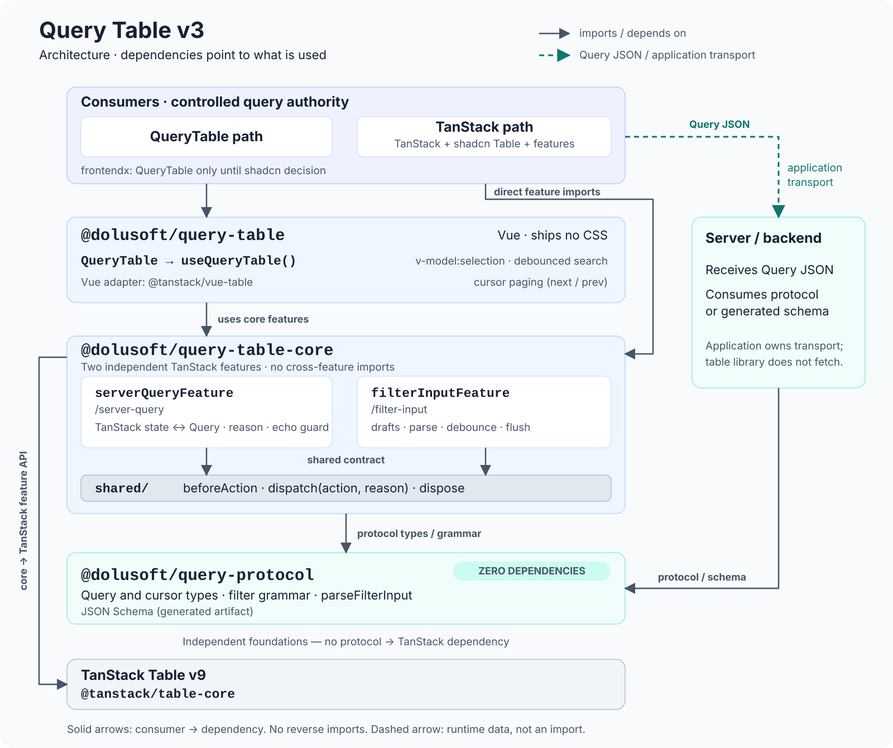
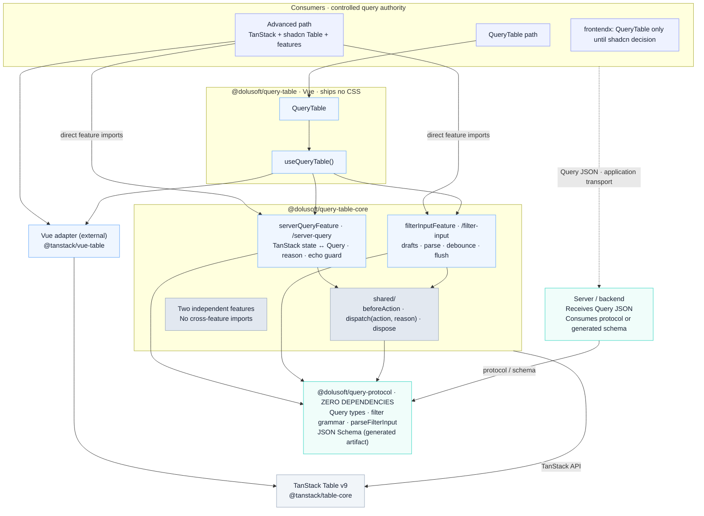

# Architecture

Query Table v3 is three packages in three layers, built on [TanStack Table](https://tanstack.com/table) v9. This page shows how they fit together, who owns which state, how the two plugins stay independent, and how size is kept in check. The reasons behind each choice are in the [decision records](../decisions/README.md); this page links to them instead of repeating them.



A plain arrow goes from the user to the dependency. The dashed arrow is the application's own transport of the query JSON to the backend. The layer order is not an import chain: `@dolusoft/query-protocol` has no dependency on TanStack.

## The three layers

| Package                       | Depends on                                         | What it holds                                                                                                       |
| ----------------------------- | -------------------------------------------------- | ------------------------------------------------------------------------------------------------------------------- |
| `@dolusoft/query-protocol`    | nothing                                            | `Query` types (page and cursor mode, search), filter rules, reasons, the filter grammar and `parseFilterInput`, the generated JSON Schema |
| `@dolusoft/query-table-core`  | `@dolusoft/query-protocol`, `@tanstack/table-core` | `serverQueryFeature`, `filterInputFeature` (entries `/server-query` and `/filter-input`) and `shared/`             |
| `@dolusoft/query-table`       | core, `@tanstack/vue-table`, `vue` (peer)          | `QueryTable` and `useQueryTable()`; its public API and DOM contract are those of 2.2.x plus opt-in additions (C-60 is the one changed behavior)                             |

The playground sits on top of all three and is never part of a package.

- **Protocol.** For everyone who speaks the query: the table, a backend (through the JSON Schema), a test. It has no dependencies, no framework and no DOM, so a .NET or Node server can use it without pulling UI code ([protocol guide](protocol.md)).
- **Core.** The behavior that makes the table worth using, as TanStack plugins, so it works without our component ([plugin guide](tanstack-plugins.md)).
- **Vue.** The component and the composable. `QueryTable` is built on `useQueryTable()` and holds no state logic of its own. (Until frontendx decides on its shadcn table, frontendx uses `QueryTable` only; a lint rule there holds the fence, ADR 0005.)

A new package is opened only when it has a different dependency set or a different consumer. The three are versioned together and released as 3.0.0 ([ADR 0002](../decisions/0002-three-packages.md), [ADR 0006](../decisions/0006-release-3.md)).

### Dependency direction

```
protocol  →  core  →  vue  →  playground
```

A package imports only from the layers before it. Inside core, a feature imports only `shared/` and the protocol, never another feature. Two checks hold this, both in CI:

- the ESLint rule `layers/boundaries` (`scripts/eslint-layers.mjs`) reads every import, re-export, dynamic `import()`, type import and package sub-path;
- `scripts/check-deps.mjs` keeps a dependency allow-list per package, for the manifest, the sources and the built files.

TanStack lives only in core and Vue, at an exact version; nothing else is added as a runtime dependency (P11, [ADR 0001](../decisions/0001-tanstack-v9.md)).

## Two independent plugins

`serverQueryFeature` turns TanStack's sort, page, column filter and global filter state into one query update with a reason, and shows the query it is given. `filterInputFeature` owns the text typed into each column's filter and applies it as rules. A consumer may want one without the other, and both are tested alone: a table with only `serverQueryFeature` is a supported configuration, and so is `filterInputFeature` on plain TanStack state.

They **never import each other**. They need to cooperate in three places (a pending filter text must be applied before a sort, a page step must be dropped when that flush changed the filters, timers must stop when the table goes away), and TanStack's column filter state cannot say any of that. So the code they share is a small contract in `packages/query-table-core/src/shared/`, and nothing else:

| In `shared/`                      | Used for                                                                                                                                     |
| --------------------------------- | -------------------------------------------------------------------------------------------------------------------------------------------- |
| `onBeforeAction`, `runBeforeAction` | `filterInputFeature` registers a flush of its pending drafts; the owner of the query runs the flushes before an action that builds on the query (C-14) |
| `dispatch`, `currentReason`, `markEmitted` | an action carries its reason, and whoever started it can ask whether it produced an update; `serverQueryFeature` is the one that emits, and says so with `markEmitted` |
| `onDispose`, `dispose`            | TanStack's `TableFeature` has no dispose hook: plugins register cleanups, the framework adapter calls `dispose(table)` (C-62)                |
| `AnyTable`, `AnyColumn`, `broad`  | TanStack's widened table and column types, in one place                                                                                      |

Per-table state is kept in a record keyed by the table object, so two tables share nothing, and a disposed table cannot be brought back to life by a late timer. The decision is [ADR 0003](../decisions/0003-two-plugins-shared-contract.md).

## Who owns the state

The **consumer is the authority**. The query (`v-model:query` in Vue, `query` and `onQueryChange` in core) is yours; TanStack's `sorting`, `columnFilters`, `pagination` and `globalFilter` slices are a *projection* of it, handed to the table whenever it changes and never written on their own (`projectServerQuery`). The same goes for row selection and, in the Vue package, for column widths. Two owners of one state drift apart, so there is exactly one.

The plugins keep only state with a short, clear lifetime:

- the **filter drafts** (text typed and a condition picked, until applied);
- the **echo history** of the filter input: the last eight rule sets emitted per column, so a late answer from the consumer does not overwrite what the user has typed since (C-18);
- the **last emitted query** of the current tick, so two actions in one tick stack and an update the consumer ignores changes nothing (C-14, C-19);
- in the Vue package: the drag preview of a resize, measured geometry, focus.

Row expansion is TanStack's (`rowExpandingFeature`), as a projection of the consumer's props, not kept a second time. The decision, and the table of where TanStack's defaults are overridden, is [ADR 0004](../decisions/0004-state-ownership.md); the same table is on the [plugin guide](tanstack-plugins.md#what-tanstack-does-and-what-stays-our-own).

## Rules, tests and the contract

The behavior is written down as numbered rules in `contract/rules.md` (C-01 to C-66). Each rule has a `Source:` line, `tanstack` when TanStack does it through its options, `own` when our plugins or the Vue layer do. Every rule is covered by a test whose name contains its number, and a test that names an unknown rule fails the build (`tests/repo/contract-traceability.spec.ts`). The plugin-level tests in `packages/query-table-core/tests/` run without a DOM and are the most exact description of the plugins.

The principles that sit above the rules are in `PRINCIPLES.md` (P1 to P15); P14 is the layer rule and P15 the plugin contract.

## Size budgets

Every package has a size budget, measured the way a consumer pays for it: a built application that imports the package by name, minus the same application without it, minified and gzipped, with everything it pulls in (TanStack included) counted (P8). The fixtures are the protocol alone, each core entry, the composable and the component. A full application is measured on its own; the budgets are not summed.

The policy (K7): size is not a goal, and a useful library may grow. A budget is the last measurement plus 5%, and a fixture may also have a ceiling. Both are there to catch **silent** drift, not to stop growth. A deliberate growth raises the budget, and the ceiling when needed, **in the same pull request**, with a one-line reason in the budget's history. It needs no separate approval.

At the time of writing, for `3.0.0-next.0` (gzip, `scripts/package-size-budget.json`):

| Fixture        | Measured | Budget | Ceiling |
| -------------- | -------- | ------ | ------- |
| `protocol`     | 1,052 B  | 1,105 B | 1,500 B |
| `server-query` | 13,676 B | 14,360 B | none   |
| `filter-input` | 11,254 B | 11,817 B | none   |
| `core`         | 17,564 B | 18,442 B | 18,500 B |

Most of the core figure is TanStack itself (the stock features the fixture uses). The 2.2.12 component, for comparison, costs 10,815 B. The trade is stated plainly in [ADR 0001](../decisions/0001-tanstack-v9.md): the gain is not less code, it is a TanStack-native path for consumers and a way to extend the table with features. Run `pnpm check:package-size` to check the budgets and `pnpm measure:package-size` to measure.

## Decision records

| Record                                                         | Decides                                                                    |
| -------------------------------------------------------------- | -------------------------------------------------------------------------- |
| [0001](../decisions/0001-tanstack-v9.md)                       | Build v3 on TanStack Table v9, pinned; the size trade-off                  |
| [0002](../decisions/0002-three-packages.md)                    | Three packages and the direction of the layers                             |
| [0003](../decisions/0003-two-plugins-shared-contract.md)       | Two independent plugins and the `shared/` contract                         |
| [0004](../decisions/0004-state-ownership.md)                   | The consumer owns lasting state; TanStack holds projections; hybrid table  |
| [0005](../decisions/0005-composable-and-component.md)          | `useQueryTable` and `QueryTable`, and the consumer fence                   |
| [0006](../decisions/0006-release-3.md)                         | Releasing 3.0.0: the `next` branch and the equivalence gate                |
| [0008](../decisions/0008-local-query-evaluation.md)            | Local query evaluation as a data source; the `tr-1` semantics profile      |

## Diagram as text

The same relationships as Mermaid, for readers that do not show the image. It opens the features and the adapter where the image merges them into packages.



`protocol ~~~ tanstack` is only an invisible layout constraint, not a dependency.
